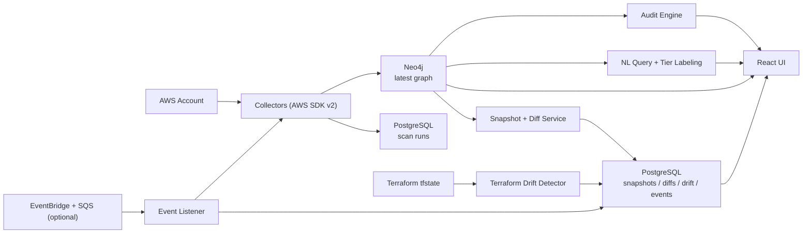
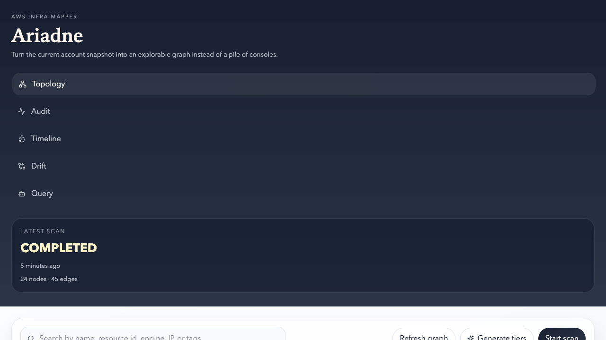
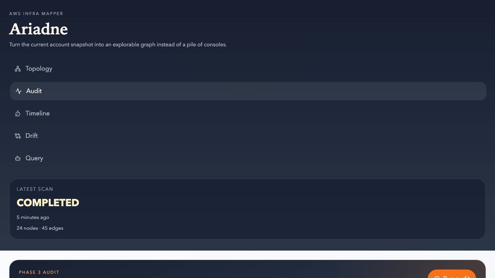
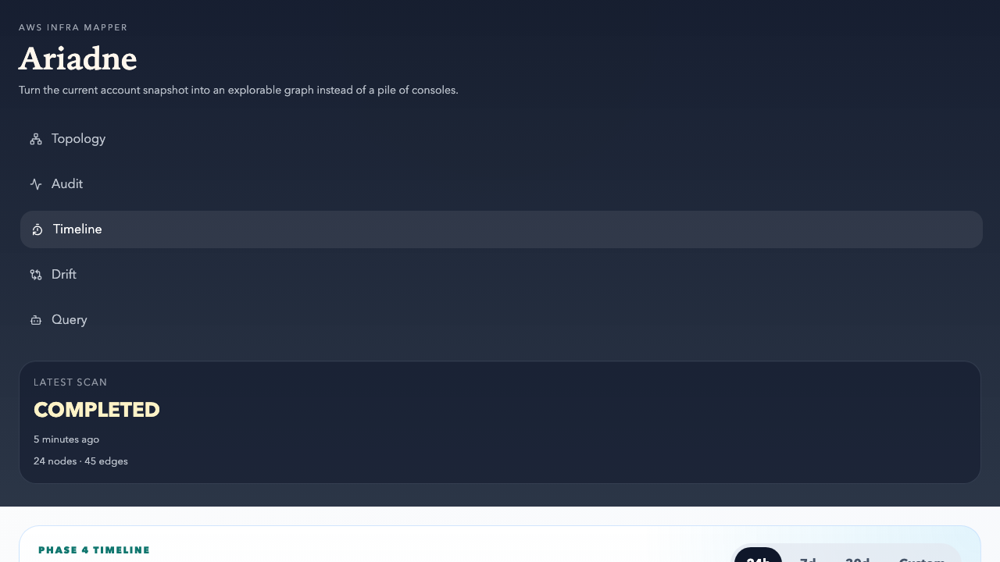
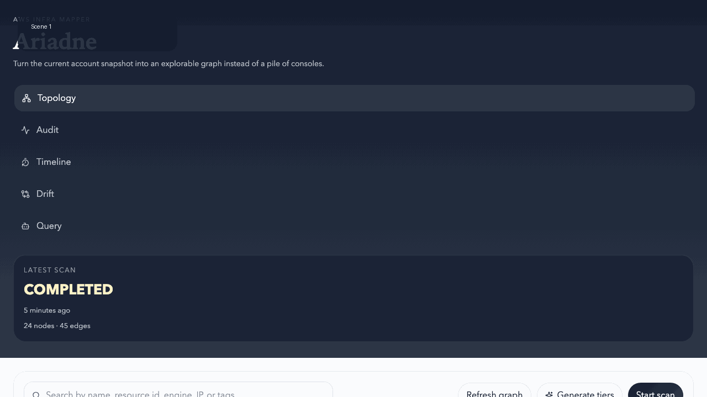

# Ariadne

[](https://github.com/SeongjunKim36/ariadne/actions/workflows/ci.yml)
[](LICENSE)

Ariadne is an open-source AWS infrastructure mapper that turns a live AWS account into an explorable graph, a security audit surface, a natural-language query target, and a time-based change history.

Instead of relying on manually maintained diagrams, Ariadne scans AWS resources, stores the live topology in Neo4j, keeps historical snapshots and drift reports in PostgreSQL, and gives operators a UI for answering questions like:

- What is running in production right now?
- Which services are likely using this RDS instance?
- Which security groups are dangerously open to `0.0.0.0/0`?
- What changed since yesterday?

## Current status

- Phase 1 complete: AWS collectors, graph storage, topology UI
- Phase 2 complete: SG rule graph, redaction engine, LLM safety boundary
- Phase 3 complete: audit engine, NL query, tier labeling, architecture summaries
- Phase 4 complete: snapshots, timeline diffs, Terraform drift, optional EventBridge + Slack notifications
- Phase 5 complete: release readiness, public docs, performance hardening, demo assets, and portfolio handoff

## What Ariadne does

- Scans core AWS resources such as VPC, subnet, EC2, security group, ALB, RDS, ECS, Lambda, S3, Route53, IAM role
- Persists the latest infrastructure graph in Neo4j
- Tracks scans, snapshots, diffs, drift runs, and event logs in PostgreSQL
- Visualizes topology with React Flow
- Runs a rule-based security audit engine
- Supports natural-language infrastructure queries through a guarded LLM gateway
- Captures historical snapshots and highlights changes over time
- Compares Terraform state with the live graph
- Supports optional near-realtime change supplementation through EventBridge + SQS

## Architecture



## Stack

- Backend: Spring Boot 3.4, Java 17, Gradle
- Graph store: Neo4j Community Edition
- Metadata store: PostgreSQL
- Frontend: React 19, React Router, React Flow, SWR, Vite
- AWS: AWS SDK for Java v2
- Tests: JUnit 5, Testcontainers, Playwright

## Quick start

### Prerequisites

- Java 17+
- Node.js 20+
- Docker
- An AWS profile or credentials if you want to scan a real account

### 1. Start infrastructure services

```bash
docker compose up -d
```

If you also want LocalStack for local AWS emulation:

```bash
docker compose -f docker-compose.dev.yml up -d
```

### 2. Start the backend

```bash
cd /Users/skl-wade/Wade/ariadne/backend
./gradlew bootRun
```

### 3. Start the frontend

```bash
cd /Users/skl-wade/Wade/ariadne/frontend
npm install
npm run dev
```

Open [http://localhost:5173](http://localhost:5173).

The local Vite server proxies `/api` requests to the backend automatically. If you deploy the frontend and backend on different origins, put them behind the same-origin reverse proxy or configure backend CORS first, then set the API origin explicitly:

```bash
cd /Users/skl-wade/Wade/ariadne/frontend
VITE_API_BASE_URL=http://localhost:8080 npm run dev
```

## Screenshots

### Topology



### Audit



### Timeline



## Demo



## Real AWS account setup

The backend uses the standard AWS SDK credential chain. A simple path is:

```bash
aws configure set aws_access_key_id "<ACCESS_KEY_ID>" --profile ariadne
aws configure set aws_secret_access_key "<SECRET_ACCESS_KEY>" --profile ariadne
aws configure set region "ap-northeast-2" --profile ariadne

AWS_PROFILE=ariadne aws sts get-caller-identity
```

For a safer setup, create a dedicated read-only IAM user and apply:

- [`iam/ariadne-readonly-policy.json`](iam/ariadne-readonly-policy.json)
- optional nginx plugin policy: [`iam/ariadne-nginx-plugin-policy.json`](iam/ariadne-nginx-plugin-policy.json)

## Key workflows

### Topology

- Run a scan
- Filter by type, environment, and VPC
- Click a node for details
- Double-click to focus relationship neighborhoods

### Audit

- Run the audit engine
- Inspect findings by severity and category
- Jump from findings to highlighted topology nodes

### Query

- Ask natural-language questions
- Inspect generated Cypher and returned subgraph
- Use guarded execution with schema validation and read-only constraints

### Timeline

- Browse snapshots over the last 24h, 7d, or 30d
- Use a custom time range
- Compare two snapshots and inspect added, removed, and modified nodes and edges

### Drift

- Provide a Terraform state file path or inline JSON
- Compare desired state against the latest captured graph
- Review missing, modified, and unmanaged resources

## Safety model

- Sensitive values are redacted before LLM transmission
- LLM access is forced through a gateway with fail-closed defaults
- Transmission levels are `strict`, `normal`, and `verbose`
- Audit logs record outbound LLM interactions
- The nginx plugin is opt-in and disabled by default

## Why Ariadne instead of Cartography, Backstage, or Datadog?

- Cartography is excellent for collection and graph storage, but it does not ship an operator-friendly topology, timeline, drift UI, or guarded NL query experience out of the box.
- Backstage is a great developer portal, but its infrastructure view is metadata-centric rather than a live AWS relationship graph.
- Datadog offers polished commercial infra maps, but Ariadne stays open-source, focuses on explainable graph queries, and keeps a stronger line between live graph state, audit results, and architecture storytelling.

The differentiator is the combination: live AWS graph + explainable UI + guarded NL query + audit + snapshot timeline in one open-source operator workflow.

## Testing

Backend:

```bash
cd /Users/skl-wade/Wade/ariadne/backend
./gradlew test
```

Frontend build:

```bash
cd /Users/skl-wade/Wade/ariadne/frontend
npm run build
```

Frontend E2E:

```bash
cd /Users/skl-wade/Wade/ariadne/frontend
npm run test:e2e
```

## Docs

- Product brief: [`docs/ko/project-a-infra-mapper.md`](docs/ko/project-a-infra-mapper.md)
- Phase checklist: [`docs/ko/specs/phase-checklist.md`](docs/ko/specs/phase-checklist.md)
- Phase 4 details: [`docs/ko/specs/phase-4-drift-timeline.md`](docs/ko/specs/phase-4-drift-timeline.md)
- Phase 5 performance notes: [`docs/ko/specs/phase-5-performance.md`](docs/ko/specs/phase-5-performance.md)
- Real-account case study draft: [`docs/ko/case-study-dongne-v2.md`](docs/ko/case-study-dongne-v2.md)

## License

MIT. See [`LICENSE`](LICENSE).
